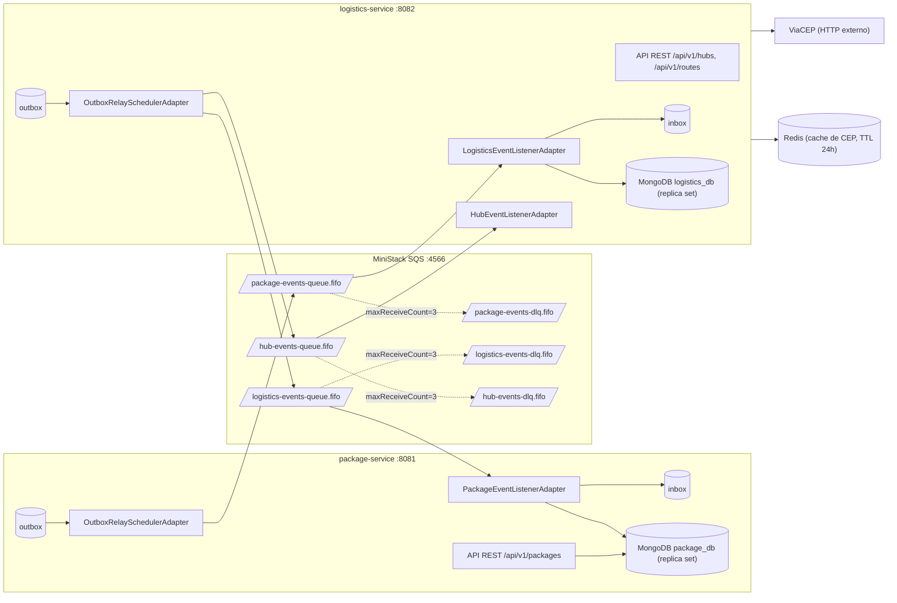
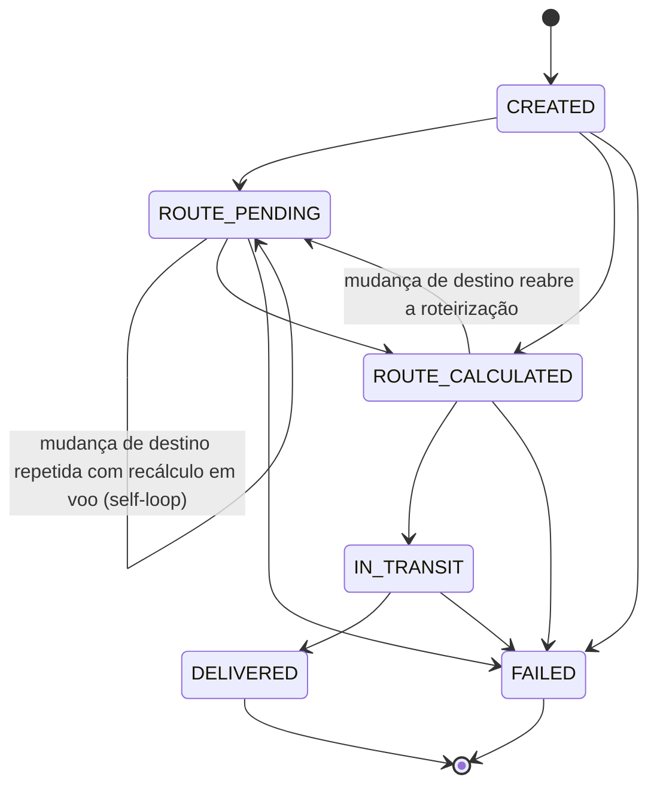

# Arquitetura do sistema distribuído

Dois microsserviços Spring Boot **nativos** (GraalVM), cada um com seu próprio MongoDB
(replica set — exigência das transações multi-documento), conversando exclusivamente por
eventos sobre SQS FIFO (MiniStack em `:4566` no ambiente local). Não há chamada HTTP
síncrona entre os serviços.



Pontos estruturais:

- **Outbox/inbox por serviço**: as coleções `outbox` e `inbox` vivem no Mongo de cada
  serviço e participam da **mesma transação** que o estado de domínio.
- **`hub-events-queue.fifo`** é interna ao `logistics-service` (eventos `hub.*` produzidos e
  consumidos por ele mesmo, via `HubEventListenerAdapter`) — o roteamento por tipo de
  evento está no `OutboxRelaySchedulerAdapter` do logistics (`route.*` → fila de saída,
  `hub.*` → fila de hubs).
- **ViaCEP é chamada real** (com retry + cache Redis de 24 h) e fica deliberadamente
  **fora** da transação de escrita — os consumidores pré-checam o inbox, computam
  (ViaCEP + Dijkstra) e só então abrem uma transação estreita para gravar
  inbox + rota + outbox.

## Fluxos de eventos

### 1. Criação → rota calculada

1. `POST /api/v1/packages` grava o pacote (`CREATED`) **e** o evento `package.created` na
   outbox, na mesma transação → responde `201` imediatamente.
2. O relay do package-service publica `package.created` em `package-events-queue.fifo`
   (`MessageGroupId = packageId`, `MessageDeduplicationId = eventId`).
3. `LogisticsEventListenerAdapter` consome → `CalculateRouteUseCase`: resolve os CEPs no
   ViaCEP, roda Dijkstra sobre o grafo de hubs e, numa transação estreita, grava
   inbox + `Route` + `route.calculated` na outbox.
4. O relay do logistics publica `route.calculated` (carregando o **`destinationCep`** usado
   no cálculo) em `logistics-events-queue.fifo`.
5. `PackageEventListenerAdapter` consome → `ProcessRouteCalculatedUseCase`: inbox, guard
   causal, guard de transição, e o pacote vira `ROUTE_CALCULATED` com `routeInfo`.

### 2. Mudança de destino → recálculo

1. `PATCH /api/v1/packages/{id}/destination` valida o estado (só antes do transporte),
   troca o `recipientCep`, volta o pacote para **`ROUTE_PENDING`** e emite
   `package.destination.changed` (com o `senderCep`, para o recálculo correto).
2. O logistics recalcula (`RecalculateRouteUseCase`) e emite `route.recalculated` — também
   com o novo `destinationCep`.
3. O pacote volta a `ROUTE_CALCULATED`. Se um `route.calculated` **antigo** (do destino
   anterior) chegar atrasado, o guard causal o descarta com ACK (invariante I4).

### 3. Falha de roteirização → route.failed

- Falha **permanente** (CEP inexistente no ViaCEP, cidade/estado sem hub, grafo sem
  caminho): o logistics publica **`route.failed`** e confirma a mensagem (ACK — não vai
  para a DLQ). O package-service (`ProcessRouteFailedUseCase`) move o pacote para `FAILED`.
- Falha **transitória** (ViaCEP fora, banco indisponível): exceção propaga → reentrega pelo
  SQS até `maxReceiveCount` → persiste, vai para a DLQ.

## Máquina de estados do pacote

Transições exatas de `PackageStatus.getAllowedTransitions()`
(`package-service/domain/src/main/java/br/furb/pkg/domain/model/PackageStatus.java`):



Os 6 estados reais: `CREATED`, `ROUTE_PENDING`, `ROUTE_CALCULATED`, `IN_TRANSIT`,
`DELIVERED`, `FAILED`. O **self-loop de `ROUTE_PENDING`** é deliberado: o usuário pode mudar
o destino de novo enquanto o recálculo anterior ainda está em voo — cada mudança emite um
novo `package.destination.changed` e o guard causal (I4) garante que só a rota do destino
final "cola".

### Transições inválidas (e por quê)

| Transição rejeitada | Razão |
|---|---|
| `DELIVERED` → qualquer | estado terminal: entrega é fato consumado; `getAllowedTransitions()` retorna conjunto vazio |
| `FAILED` → qualquer | estado terminal: falha permanente exige novo pacote, não ressuscitação |
| `ROUTE_CALCULATED` → `ROUTE_CALCULATED` | **proibida no agregado**: rota só pode ser (re)aplicada após reabertura explícita (`ROUTE_PENDING`). É isso que faz uma **duplicata/atraso** de `route.calculated` ser inaplicável por construção |
| `CREATED`/`ROUTE_PENDING` → `IN_TRANSIT` | não se transporta sem rota calculada |
| `CREATED`/`ROUTE_CALCULATED` → `DELIVERED` | não se entrega sem transportar |
| `IN_TRANSIT` → `ROUTE_PENDING` | mudança de destino após o início do transporte é rejeitada (`InvalidPackageStateException` → HTTP 422) |

**Por que o consumidor faz skip em vez de lançar exceção?** A mesma regra tem dois
tratamentos conforme a borda. Na borda **HTTP** (`PATCH /status`), transição inválida é erro
do chamador → `InvalidPackageStateException` → 422. Na borda **de eventos**
(`ProcessRouteCalculatedUseCase`), transição inaplicável é **fato esperado do modelo
assíncrono** (duplicata, atraso, corrida) — lançar exceção causaria reentrega e, após 3
tentativas, mandaria um evento *legítimo porém atrasado* para a DLQ, poluindo o canal de
poison messages. Por isso: **skip + WARN + ACK**, com o claim do inbox já commitado.

## Envelope de eventos

Todo evento publicado tem o mesmo envelope (montado pelo relay —
`OutboxRelaySchedulerAdapter.buildEnvelope()`):

```json
{
  "eventId": "uuid — também é o MessageDeduplicationId",
  "eventType": "package.created | package.destination.changed | package.status.updated | route.calculated | route.recalculated | route.failed | hub.*",
  "occurredAt": "instante de criação na outbox (ISO-8601)",
  "source": "package-service | logistics-service",
  "version": "1.0",
  "payload": { "packageId": "...", "destinationCep": "(eventos route.*)", "...": "..." }
}
```

## FIFO e `MessageGroupId`

- **`MessageGroupId = packageId`**: o SQS FIFO garante ordem **dentro do grupo**; grupos
  distintos fluem em paralelo (é o que limita o estrago de uma poison message ao seu
  pacote — I7).
- **`MessageDeduplicationId = eventId`**: dedup do broker numa janela de 5 minutos —
  conveniência, não garantia (I9); a garantia é o inbox.
- A ordem **na origem** é defendida pelo próprio relay (`existsEarlierUnpublished` +
  `releaseClaim`): o evento N+1 de um grupo não é publicado enquanto o N não estiver
  `PUBLISHED`, mesmo com múltiplos workers do relay.
